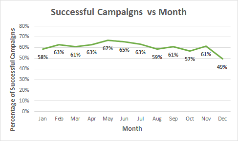

# Kickstarting with Excel

## Overview of Project
The data analyzed in this project will show the effectiveness of Kickstarter campaigns as related to several variables.

### Purpose
The purpose of this analysis is to determine the effect of distinct characteristics to predict the success of a Kickstarter campaign for the play "Fever".
This analysis was accomplished by looking at data related to "Launch Dates" and "Fundraising Goal Amounts" to predict threshold values and trends that might be used to influence the probability that this campaign will achieve its financial goal.

## Analysis and Challenges

### Analysis of Outcomes Based on Launch Date

This first chart shows the outcome of every project in the "Theater" category organized by the month in which the project was launched. This graph suggests that launching a campaign during the spring offers the best probability of success, which slowly drops off to its lowest probability in late fall/early winter. This trend is shown in two different ways -- the amount of successful campaigns and the gap between successful campaigns and failed campaigns. 

As the line chart shows, the maximum amount of successes happens in May with a value of 111 successful campaigns. The minimum amount of successes is in December with a value of 37 successful campaigns. This suggests that even though the springtime has many competing projects launching at the same time, many of those projects are still able to find financial success. And conversely, even though a campaign launched in December has the smallest amount of projects to compete against, that month still has the worst rate for success.

(2) The largest spread between successes and failures occurs in the early spring and lasts through early summer while the gap between successes and failures is small in the winter, to the extent that the lines appear to nearly intersect in December. The gap for the spring months is characterized by high success rates for all projects in the months of May (67%), June (65%), and Feb/Apr/July (63%). Meanwhile the success rates for December (49%), October (57%) and January (58%) are the lowest of the twelve months. These values can be seen in the gap between the green and red lines in the chart above, or also can be visualized in the line chart below.

Based on both metrics it seems that the best time to launch a campaign would be during the months from April - July.

### Analysis of Outcomes Based on Goals

The above chart shows results of Kickstarter campaigns for all projects in the "plays" subcategory. The campaigns have been grouped based on the quartile values for fundraising goals, so each group contains roughly 250-275 "plays" project outcomes. The data shows that for the lowest fundraising goals there is approximately a '3:1' ratio of successful campaigns compared to failures, which slowly decreases to around a '5:2' ratio for campaigns up to $5000. Then for the upper 25% of goal values (those higher than $5000) we can see that the success to failure ratio decreases drastically to a nearly '1:1' ratio. In fact, this last category actually has a slightly heavier weight for failures than for successes.

For a more detailed look at outcomes for the larger goal amounts, the line chart "Outcomes Based on Goal" shows the percentage of successful and failed campaigns for even more categories, this time sectioning the fundraising goal amounts by intervals of roughly $5000. This chart also showcases a similar negative correlation between fundraising goal amounts and probability of a successful outcome. As seen in this chart, the rate of success is only higher for goals of less than $15000 and for goals between $35000-$45000. The chart also shows that when a goal is greater than $5000 there is a sharp increase in the rate of failures as compared to less expensive projects.

These graphs suggest the budget of $10000 for the play "Fever" may effect its chances to succeed. While it is not a predictor of certain doom, the likelihood of success would be better if the budget were cut to a lower, more common Kickstarter goal for plays.

### Challenges and Difficulties Encountered
One of the major challenges I ran into was the unintentional messaging that the line chart "Outcomes Based on Goal" might convey. Because each x-axis value on the line chart represents a range of numbers, it is very likely that a person quickly looking at the chart would come away thinking: "A $15000 campaign has a better chance of success than a $19999 campaign", since the 'success' line is higher on the left side of the $15000-$19999 range. Even though the x-axis is made of discrete values, it is very likely that a client would think of it as an axis with continuous values, and conflate the continuous line with the discrete values.

The other big challenge I found with the "Outcomes Based on Goal" graph is that it implies an equal distribution between the different fundraising goal intervals. The line chart cannot do justice to the distribution of data since it is majorly skewed right distribution (as can be seen in the Box chart below). In fact, the box chart shows that plays with a goal greater than $10700 are actually considered outliers because so many of the plays use a cheap budget. This means the play Fever is within a few hundred dollars of being considered an outlier because it is such a high goal amount.

This distribution is not even suggested in the "Outcomes Based on Goal" graph. On that line chart, the first individual data point (projects <$1000) actually represents more projects (186) than the final 9 data points (projects >$10000) all combined (158). It struck me as a problem that 15% of the projects were taking up 75% of the line graph's space.

To counteract this problem, I went beyond the requirements and grouped the results in categories based on the quartiles (0,1500,3000,7000,200000). Then I created a bar chart to still directly compare the successful vs failed campaigns. While it covers less categories than the line chart, I believe that it still conveys the same negative correlation which the line chart does, while not implying that a sample of n=6 has a similar confidence level to a sample of n=186.

## Results

- What are two conclusions you can draw about the Outcomes based on Launch Date?

The peak of successes happens in May with a value of 111 successful campaigns. The lowest amount of successes is in December with a value of 37 successful campaigns. This suggests that even though the springtime has many competing projects launching at the same time, many of those projects are still able to find success. And conversely, even though December has the fewest total projects launched to compete against, that month still has the worst rate for success.

The largest spread between successes and failures occurs in the early spring and lasts through early summer while the gap between successes and failures is small in the winter, to the extent that the lines appear to nearly intersect in December. The gap for the spring months is characterized by high success rates for all projects in the months of May (67%), June (65%), and Feb/Apr/July (63%). Meanwhile the success rates for December (49%), October (57%) and January (58%) are the lowest of the twelve months.

- What can you conclude about the Outcomes based on Goals?

There is a negative correlation between fundraising goal amounts and probability of a successful outcome. The rate of failures is actually higher than the rate of successes for goals of approximately $15000-$35000 and for $45000 and more.

- What are some limitations of this dataset?

The biggest limitation of the dataset is a lack of campaigns with very high goal amounts. Since Louise currently has a budget of about $10000 it would be beneficial to have more campaigns with a similar goal to gather data from. Instead we are forced to draw our conclusions from mostly campaigns with less than half of her goal amount.

- What are some other possible tables and/or graphs that we could create?

We could create some bar charts or histograms to show data based on equal amounts of campaigns, be that based on quartiles or percentile chunks of the data. We could also potentially use some pie charts to directly compare "Success" to "Failure" amounts based on different ranges of data. 
